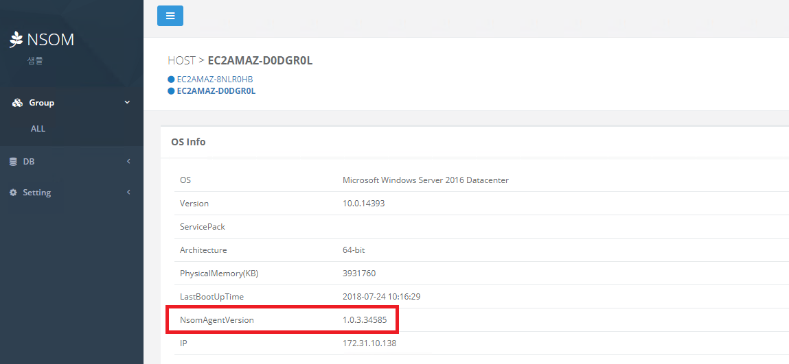

# NSOM WEB (Windows) 설치 가이드

1. Redis 설치

   * [Redis 다운로드](https://github.com/MicrosoftArchive/redis/releases) 후 설치
   * 별도 설정 없이 Next 진행
   * 설치 진행 중 Redis 홈 디렉토리 지정 단계에서 홈디렉토리 경로 확인 (default : C:\Program Files\Redis)

2. Redis 홈디렉토리로 이동

   ```
   C:\Program Files\Redis
   ```

3. redis.windows-service.conf 파일을 수정하여 bind 설정

   ```
   bind 0.0.0.0
   ```

   * 변경 전 : bind 127.0.0.1
   * 변경 후 : bind 0.0.0.0

4. Redis 서비스 재시작

   * 방법1 : 윈도우키 입력 > 서비스 또는 service 입력 후 실행 > Redis 항목을 찾아 재시작
   * 방법2 : 관리자모드로 cmd 실행
     1. sc stop Redis
     2. sc start Redis

5. [크롬 설치](https://www.google.com/intl/ko/chrome/thank-you.html?standalone=1&statcb=0&installdataindex=empty)

6. nsom-windows-web-installer\nsom-windows-web\nsom-web.bat 파일의 환경 변수 설정

   ```
   ... 생략 ...
   set PERMISSIONS=관리자ID@nexon.co.kr
   set SERVICE_NAME=샘플 서비스
   set TITLE=샘플
   set REDIS=localhost:6379
   ... 생략 ...
   ```
   * 테스트 용도로 SMTP 연동 없이 사용을 원할 경우 아래 설정 추가

     ```
     set DEVELOPEMENT_MODE=true
     ```

     * 라이브 환경에서는 사용하지마십시오.

7. nsom-windows-web-installer\setup.bat 실행

8. 크롬 브라우저에서 http://localhost 접속


# NSOM AGENT 업데이트 가이드

* NSOM 에이전트가 업데이트 된 경우 갱신하기 위한 가이드입니다.


1. nsom-windows-web-installer\archive\v[버전]\\[압축파일명]

2. 에이전트 업데이트 정보 갱신

   ```
   http://[NSOM WEB IP]/api/updateAgentInfo?agentType=windows&scriptUri=http://[NSOM WEB IP]/script/&scriptFile=update.bat&archiveUri=http://[NSOM WEB IP]/archive/&archiveFile=nsom-agent.zip&hostType=all&version=1.0.0
   ```

   - agentType : NSOM Agent의 종류 (Linux or Windows)
   - scriptUri : NSOM Agent에서 업데이트 시 사용할 스크립트를 다운로드 받을 URI
   - scriptFile : 위 URI에서 다운로드 받을 스크립트 파일명
   - archiveUri : 실제 업데이트 할 에이전트를 다운로드 받을 URI
   - archiveFile : 위 URI에서 다운로드 받을 아카이빙 파일명
   - hostType : 업데이트 할 호스트 종류 (all : 모든 호스트 대상, 특정 호스트명 : 지정한 호스트만 대상)
   - version : 업데이트 대상 버전
   - updateCheckSec : 에이전트에서 업데이트 체크할 주기 입력

3. 설정 예

   ```
   1. 압축 파일 복사 (압축파일명 : nsom-agent.zip)
   nsom-windows-web\archive\v1.0.4\nsom-agent.zip
   
   2. 업데이트 정보 갱신
   http://172.31.4.251/api/updateAgentInfo?agentType=windows&scriptUri=http://172.31.4.251/script/&scriptFile=update.bat&archiveUri=http://172.31.4.251/archive/&archiveFile=nsom-agent.zip&hostType=all&version=1.0.4&updateCheckSec=60
   ```

4. NSOM WEB의 호스트 OS Info에서 NSOM AGENT 버전 확인

   

   